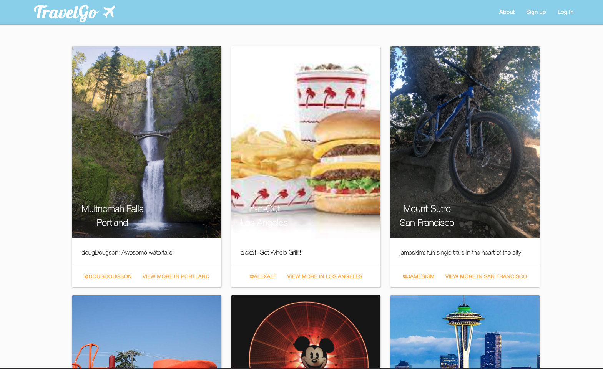
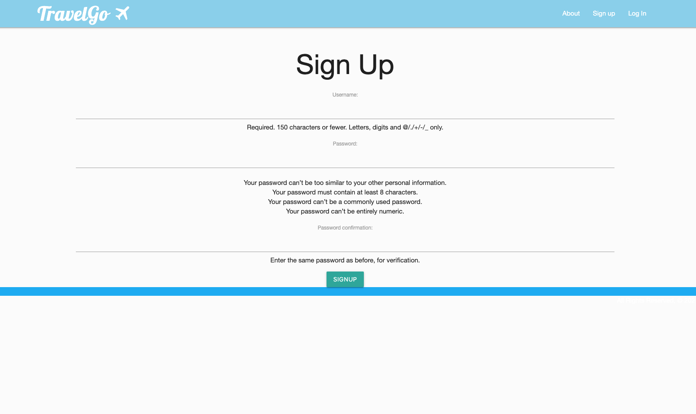
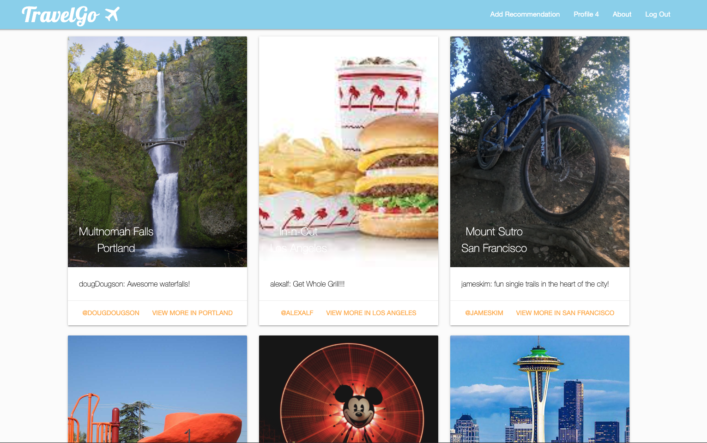
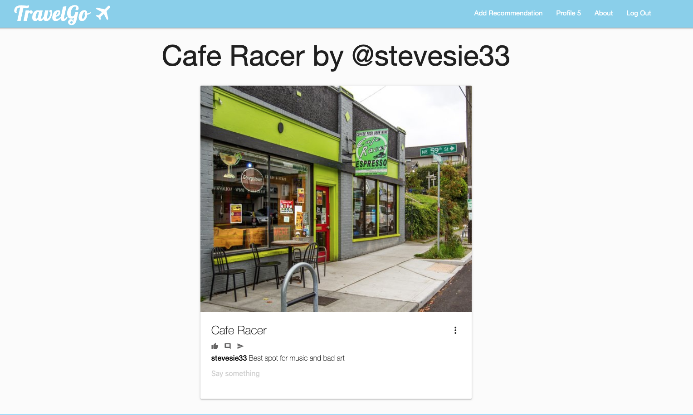
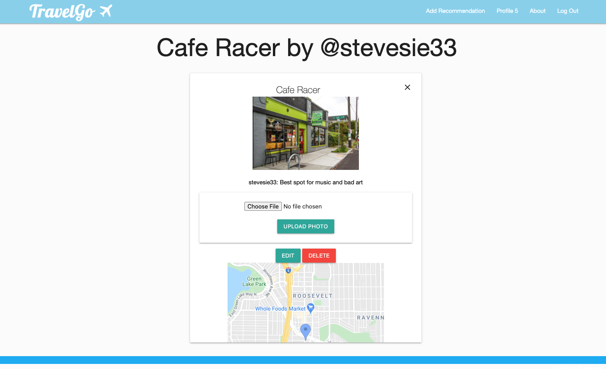
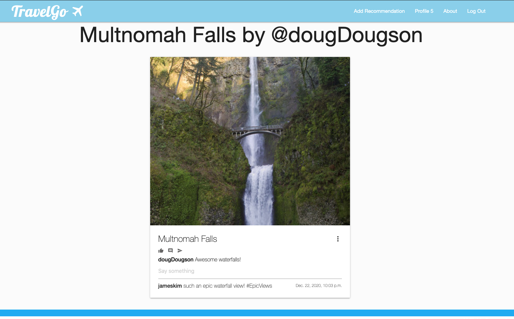
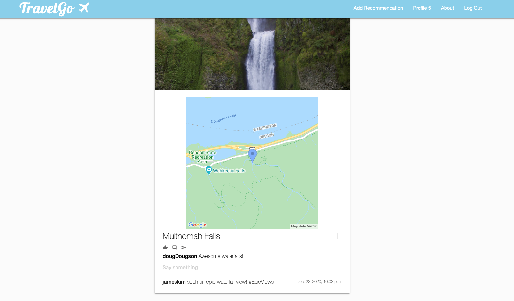

## Intro
---
<strong> TravelGo </strong> is a web application dedicated to finding and sharing expereinces. Users post recommentations for others find inspiration for travel, adventures, weekend getaways, and cool city spots in four main cities on the West Coast of the United States. 

## Background
---
This project was built by [James Kim][1], [Alex Alferez][2], and [Thom Strub][3] - three West Coast devs who love exploring.  

 <strong>TravelGo's</strong> strength is its focus on one thing- shared experiences that help people find inspiration quickly. 

The internet has plenty of travel sites, however, many are slightly complicated, with review systems and user check-ins. 
<strong> TravelGo </strong> provides users with a simplified UI to find inspiration for a last minute trip or help others do the same. It featues:
  
- user-generated ideas
- minimalist UI to focus on the recommendations from the users
- comments from other users to offer more insight or detail for a recommendation
- photos uploaded by users to show off their recommendations
- search by location for those who know where they want to search

## Screenshots
---
Landing Page  
  
Django Sign-In  
  
Home / Index Page

Recommendation  
  
Expand for Map and Edit / Delete Options

Recommendation Card

Map Detail

## Technologies Used
---
- Python
- HTML
- CSS
- Django
- PostgreSQL
- AWS S3 Cloud Storage
- Django Authentication
- Google Maps API

## Getting Started  
---
Project planning elements:  
- Our [Trello Planning Board][4] includes details of the team workflow as well as our ERD, Wireframes, and User Stories.
- More details on our project pitch are in our [Pitch Deck][5]
   
Check out [TravelGo][6] on Heroku!

## Next Steps  
---
Future enhancements of this project include:  
- expanding the scope of the project beyond four cities on the west coast of the USA
- search by map UI where users can find recommendations via interactive map
- itenerary feature that allows the user to add recommendations to a potential itenerary
- Search feature that will query different attributes of a recommendation such as "night clubs" or "hiking".

[1]: https://github.com/jamesjkim88
[2]: https://github.com/alexalferez
[3]: https://github.com/thomstrub/
[4]: https://trello.com/invite/b/QJiYx0lW/5efabd104332f57874b741a13bf66114/travelgo
[5]: https://docs.google.com/presentation/d/1B9WzjgWKN_j_kcsjMiYXFOeID0o8sJ49I4FcEguDTHw/edit?usp=sharing
[6]: https://go-travel-go.herokuapp.com/